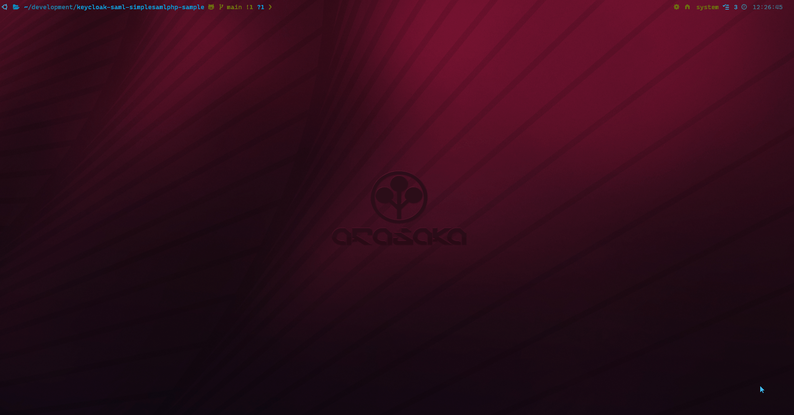
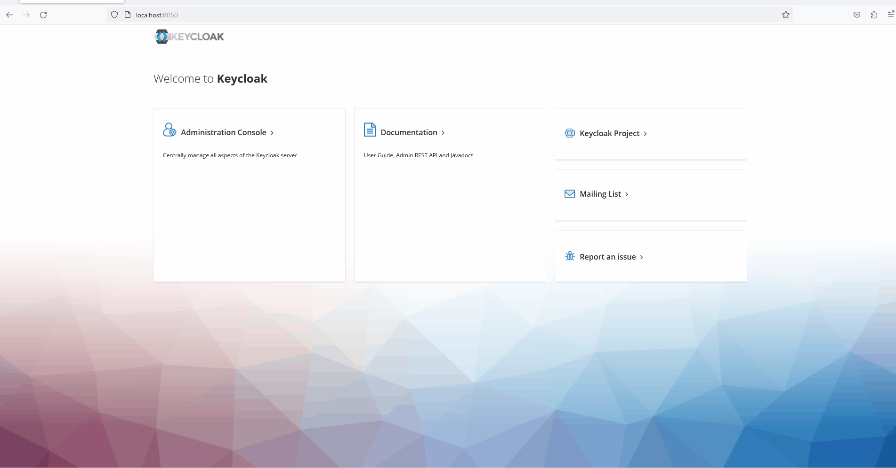
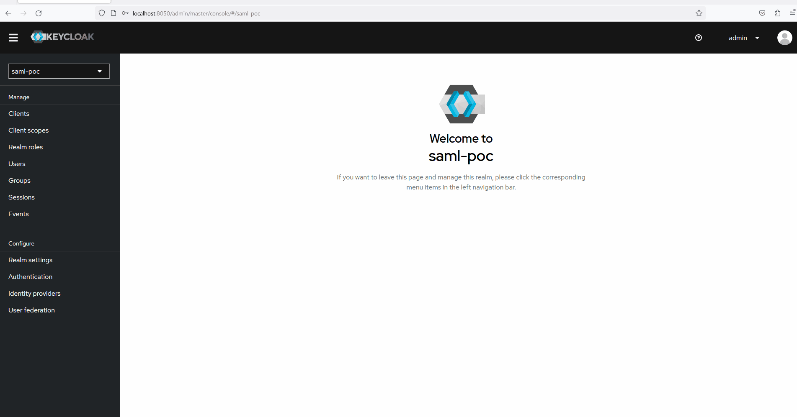
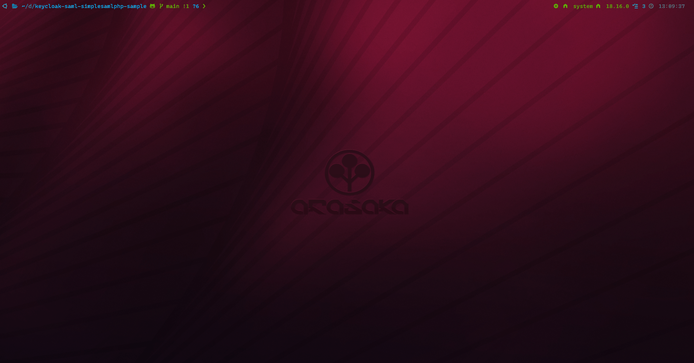

# keycloak-saml-simplesamlphp-sample

## Context

For a POC, I needed to configure SAML Identity Provider for Keycloak. For simplicity, I took the first SAML provider I found on Google that can be ran with docker: SimpleSAMLphp.

I was very new to SAML, so it took me a moment to configure SimpleSAMLphp and make it work with Keycloak.

I wrote this tutorial to explain the steps if someone need to do the same thing.

## Requirements

- docker
- docker-compose
- npm

## Getting started

### Variables check list

In the next sections, for simplicity, we will use variables. We provide default values that has been used during the setup of this tutorial, but feel free to modify it.

- KC_URL: http://localhost:8050
- IDP_URL: http://localhost:8080
- KC_SAML_ENTITY_ID: http://localhost:8050/realms/saml-poc
- REALM_NAME: saml-poc
- ALIAS: simplesaml
- TEST_APP_CLIENT_ID: test-app
- TEST_APP_CLIENT_SECRET: generated by keycloak in this tutorial
- TEST_APP_URL: localhost:3000
- NEXT_AUTH_SECRET: generated by Vercel in this tutorial

### Setup docker compose



In _deploy_ folder, you can find a docker-compose file that we will use to setup our test environment. It will run two containers :

- **idp**: our SimpleSAMLphp instance as Identity Provider
- **kc**: our Keycloak instance that will be used as broker

By default, **idp** will run on port 8080 and **kc** will run on port 8050. We used *host* network\_mode for this containers to make it easier to run on the same host. If you don't want to use *host* network\_mode, you can for example configure *extra_hosts* with a name other than *localhost* so that **kc** container can communicates with **ipd** container and browser redirections can work.

For the **idp** container, you can see 2 environment variables and 2 volume mounts:

- env variable **SIMPLESAMLPHP_SP_ENTITY_ID**: The Entity ID of the Service Provider. Here, for simplicity, we used the URL of our Keycloak, with the realm that we will use. You can change it with anything you want, we will use it in Keycloak configuration.
- env variable **SIMPLESAMLPHP_SP_ASSERTION_CONSUMER_SERVICE**: The Service Provider ACS, it's the redirect URI that will be used after successfull login on SimpleSAMLphp. With Keycloak, the format is always the same: http(s)://<host>:<port>/realms/<your-realm>/broker/<SAML-provider-alias>/endpoint.
- volume **authsources.php**: This file contains hard coded admin and users for SimpleSAMLphp. In this file, we configured users with attributes that mimic those of Azure AD.
- volume **saml20-idp-hosted.php**: This file contains a custom configuration for SAML 2.0 Identity Provider hosted by SimpleSAMLphp. It's the default configuration, we just added 2 lines in it to set the NameIDFormat as Persistent and to define the user attribute that will be used as NameID.

When everything is OK with your configuration, open the _deploy_ folder in a terminal and run the following command to start **idp** and **kc**:

```sh
docker-compose up -d
```

If everything worked, you should be able to open **idp** at <IDP_URL> and **kc** at <KC_URL>.

**Attention**: Keycloak can take a while to start so the interface may not be available directly after starting. You can check the logs of the **kc** container.

### Configure SAML provider in Keycloak



The next step is to configure a SAML provider in Keycloak. But first we will create a new realm for our test.

Open <KC_URL>, click on Keycloak admin console and connect using the Keycloak admin and password (by default, if you didn't changed it in docker-compose: admin/admin). Then create the realm <REALM_NAME>.

Click on Identity providers in the Configuration section of the menu and choose SAML v2.0.

Fill the form with the following information:

- **Alias**: \<ALIAS\>
- **Display name**: Whatever you want, for example: SAML with SimpleSAMLphp
- **Service provider entity ID**: The value you configured in <SIMPLESAMLPHP\_SP\_ENTITY_ID> env variable
- **Use entity descriptor**: ON
- **SAML entity descriptor**: <IDP_URL>/simplesaml/saml2/idp/metadata.php (you can find this URL in your **idp** instance by clicking on *Federation* tab > SAML 2.0 IdP Metadata > Show metadata, it's the first url on the page that will open)

If everything worked correctly, you should see a green check next the SAML entity descriptor url indicating that Keycloak loaded metadata of SimpleSAMLphp IdP. You can next configure the provider as you want, but we'll let the default configuration for this tutorial.

**Attention**: make sure that the Redirect URI configured on the provider is exactly the same you configured in **SIMPLESAMLPHP_SP_ASSERTION_CONSUMER_SERVICE** environment variable.

Click on Add to save the provider.

### Configure a client for the test App



To test the connection with a real app, this repository contains a NextJS app with Next-Auth configured for authentication. We will not explain details of Next.js and Auth.js here, but you can find more information on their dedicated websites:

- Next.js: [Next.js docs](https://nextjs.org/docs)
- Auth.js: [Auth.js guides](https://authjs.dev/guides)

For simplicity, we just followed the Auth.js tutorial to setup a login button in a next app using page router.

To allow our app to authenticate users with Keycloak, we need to configure a new OIDC Client in Keycloak.

Open the admin console, navigate to your realm and, in the menu, click on Clients > Create client.

Fill the forms with the following information (we just filled required data):

- General Settings:

  - Client type: OpenID Connect
  - Client ID: <TEST_APP_CLIENT_ID>

- Capability config:

  - Client authentication: ON
  - Authentication flow: Standard flow / Direct access grants / OAuth 2.0 Device Authorization Grant

- Login settings:
  - Valid redirect URIs: <TEST_APP_URL>\*

Click on save and your client is configured. Open the Credentials tab and note the Client secret. We will refer to it as <TEST_APP_CLIENT_SECRET>

### Configure the test App

In this repository, create a .env file with the following content:

```env
KEYCLOAK_CLIENT_ID=<TEST_APP_CLIENT_ID>
KEYCLOAK_CLIENT_SECRET=<TEST_APP_CLIENT_SECRET>
KEYCLOAK_ISSUER=<KC_URL>/realms/<REALM_NAME>
NEXTAUTH_SECRET=<NEXTAUTH_SECRET>
```

You can generate <NEXT_AUTH_SECRET> using this url: https://generate-secret.vercel.app/32.

### Test the authentication



Run the following commands to install everything required by the test app and to run it:

```sh
npm install \
npm run dev
```

Navigate to <TEST_APP_URL> and click on the "Sign in" button. You should be redirected to Keycloak. If this is not the case, check your .env file to see if the Keycloak url is correct in KEYCLOAK_ISSUER variable.

On the Keycloak authentication page, you should see the SAML provider you configured, in our case: SAML with SimpleSAMLphp. Click on it and you should be redirected to SimpleSAMLphp login page.

Log in with the following credentials: user1 / password
If it's your first login, you should be redirected to Keycloak that will require you to update your user information. This is because Keycloak import every user that log in with external Identity Provider. On the Keycloak page, you should see that the User ID is filled with the value of the attribute you used as NameID in SimpleSAMLphp. In our case, it's the user email claim. Fill the form, save and you should be redirected to the test app. You should now see that you are authenticated.
